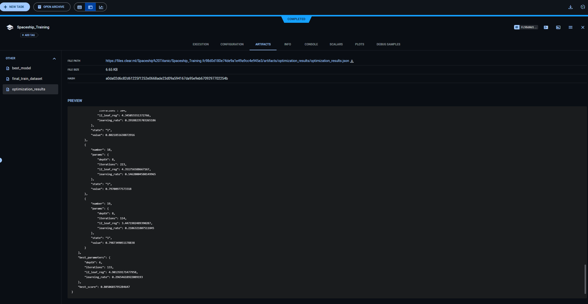
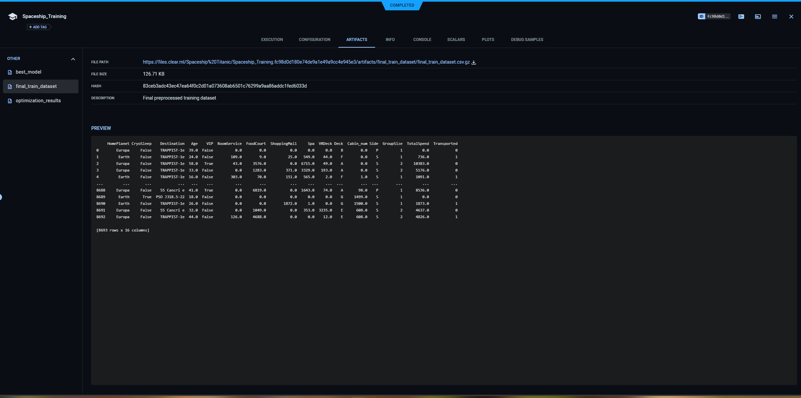
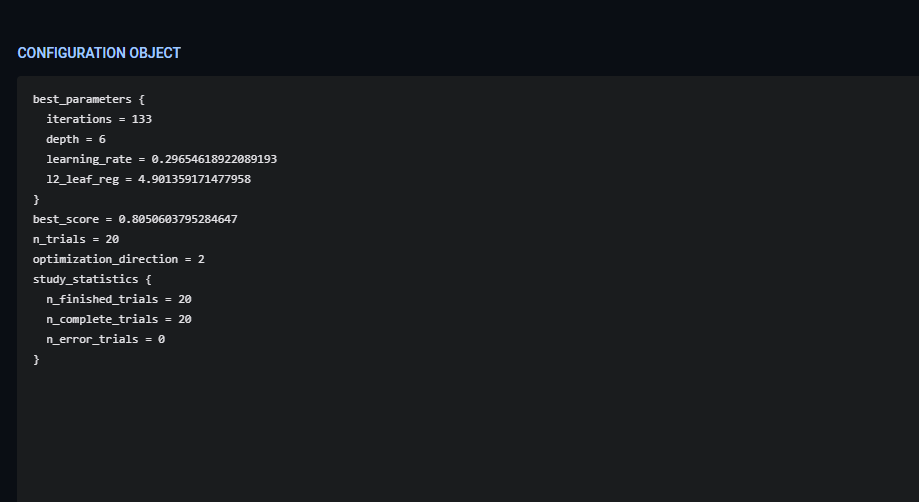
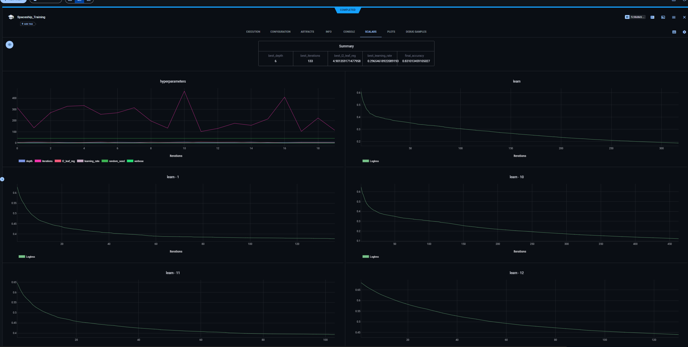

# Spaceship titanic solution with CatBoost + MLOps

fullname and group: Лунев Владислав Витальевич 972301

## About:
Machine learning project. It was necessary to solve the Spaceship Titanic problem. 
Use optuna and Poetry to find optimal parameters for freezing dependencies. Used CatBoostClassifier. Also used ClearML for MLOps (saving parameters and artifacts)
Best solution: 0.80640 accuracy
## How to: 
- clone repository
- input in cl: poerty install 
- input in cl for train: poetry run python py/main.py train --dataset data/train.csv --n_trials 20
- input input in cl for predict: poetry run python py/main.py predict --dataset data/test.csv

ClearML experience:

